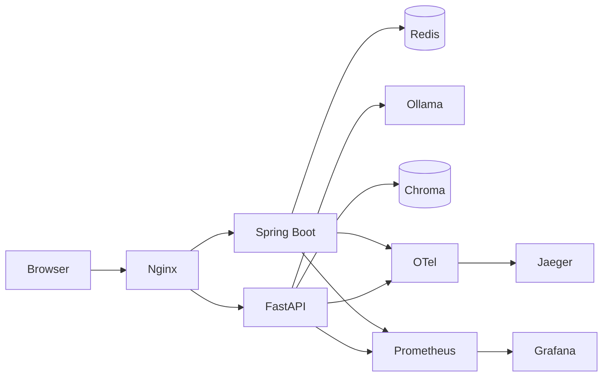

# Campus/Enterprise AI Assistant

    

```bash
docker compose up -d
```

本项目面向“校园场景可演示、企业场景可扩展”的 AI 助手落地需求，采用前后端分层与可观测优先设计。前端使用 Vue3 + TypeScript + Element Plus，内置 Markdown 渲染、SSE 流式输出、暗色模式与响应式布局；Nginx 统一代理静态资源与 API；Spring Boot 提供鉴权、会话、异常与业务编排；FastAPI 承载 RAG 检索与 ReAct 推理循环。项目强调一键启动、链路可追踪、指标可量化、故障可降级，适合作为校招项目与企业 PoC 的统一工程模板。

## 架构拓扑



## 里程碑

| 阶段 | 目标 | 已完成内容 |
|---|---|---|
| Milestone 1 | 核心架构落地 | 建立 Spring Boot + FastAPI + Vue3 三层骨架，打通 RAG 检索与 ReAct 推理主链路 |
| Milestone 2 | 安全与鉴权 | 引入 Spring Security + JWT、登录签发、统一鉴权与全局异常响应 |
| Milestone 3 | 可观测与运维 | 集成 OpenTelemetry、Prometheus、Grafana、Jaeger，补全 Docker Compose 一键运行 |
| Milestone 4 | 质量保障 | 增加 Pytest、SpringBootTest、Playwright、k6，形成分层测试矩阵 |
| Milestone 5 | 工程化交付 | 配置 GitHub Actions（lint→test→build→docker push），完善 README/CHANGELOG 与贡献规范 |

## 核心特性

- 安全基线：Spring Security + JWT 全局生效，接口按最小权限开放，参数校验与统一异常响应默认启用。
- 稳定性基线：Redis 缓存会话历史，工具调用支持超时、重试、熔断与降级，避免单点依赖拖垮主链路。
- 智能能力：文档上传后自动解析、分块、向量化入库，结合 ReAct 的 Thought→Action→Observation 轨迹实现可解释问答。
- 交互体验：SSE 按 token 持续输出，前端实时拼接并展示 trace，支持暗色模式与移动端布局自适应。
- 运维能力：结构化日志、Prometheus 指标、OpenTelemetry Trace、Jaeger 回放与 Grafana 面板形成完整观测闭环。

在工程实践上，项目默认采用“配置外置、依赖可替换、接口可回归”的约束：模型可从本地 Ollama 平滑切换到企业私有推理服务，向量库可按规模替换为 Milvus/PGVector，认证与审计链路可以无缝接入现有 IAM 与日志平台，保证从 Demo 到生产不需要推倒重来。

## 测试矩阵（覆盖率与执行指令）

| 类型 | 目录 | 命令 | 产物 |
|---|---|---|---|
| Pytest 单元/集成 | `tests/python` | `./tests/scripts/run_python_tests.sh` | `tests/coverage/python/` |
| SpringBootTest 联调 | `backend-java/src/test` | `./tests/scripts/run_java_tests.sh` | `tests/coverage/java/` |
| Playwright E2E | `tests/e2e` | `./tests/scripts/run_e2e_tests.sh` | `tests/coverage/playwright-report/` |
| k6 并发压测 | `tests/k6` | `./tests/scripts/run_k6_load.sh` | `tests/coverage/k6-summary.txt` |

## 安全与可观测性设计

认证链路采用“登录签发 JWT、业务接口统一校验、错误结构统一返回”的模式，避免接口行为不一致导致的排障成本。Spring Boot 暴露 `actuator/prometheus`，FastAPI 暴露 `/metrics`，Prometheus 统一采集后交由 Grafana 展示容量、延迟与错误率。分布式追踪通过 OTel Collector 汇聚至 Jaeger，可按 TraceID 回放跨服务调用路径。日志统一为 JSON 结构，便于接入 ELK/Loki 并按字段检索。

## 生产部署清单

使用 `.env.example` 外置配置，生产环境建议以 Secret 注入敏感项；开启优雅停机与健康探针，支持滚动发布；首次部署前执行 `./scripts/bootstrap_models.sh` 预拉模型；推荐 Python 3.11 与 CI 版本保持一致，减少依赖编译差异；上线后优先检查 Grafana（`:3000`）、Prometheus（`:9090`）、Jaeger（`:16686`）三类观测入口是否可用，再执行压力回归与灰度放量。

如果用于真实业务，建议先以只读知识库问答上线，稳定后再逐步开放工具写操作；并通过压测阈值、告警规则与故障演练提前验证峰值场景，确保在高并发、模型抖动或下游服务不稳定时仍具备可预期的退化行为与恢复速度。

## 贡献规范

1. 提交前必须执行 `make lint && make test`，确保基础质量门禁通过。
2. 新功能需附测试与风险说明，覆盖率产物统一写入 `tests/coverage/`。
3. PR 描述请包含变更范围、回滚方案、验证命令与关键截图。
4. 禁止提交密钥、模型权重、大体积临时文件，遵循 MIT License。
