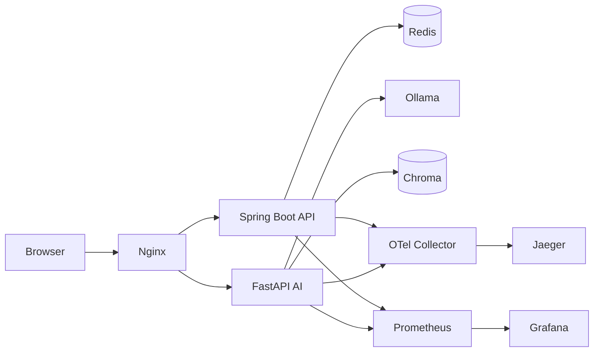

# Enterprise Architecture

## Service Responsibilities

- `frontend/`: Vue3 + TypeScript + Element Plus，支持 Markdown 与 SSE。
- `backend-java/`: 鉴权、会话缓存、API 编排、SSE 代理。
- `ai-service/`: RAG、ReAct Agent、工具注册/熔断降级、状态持久化。
- `deployments/observability`: Prometheus + OTel Collector + Grafana + Jaeger。

## Reliability and Security

- JWT auth + Spring Security
- Redis session cache with fallback
- Global exception handling and validation
- Graceful shutdown and health probes
